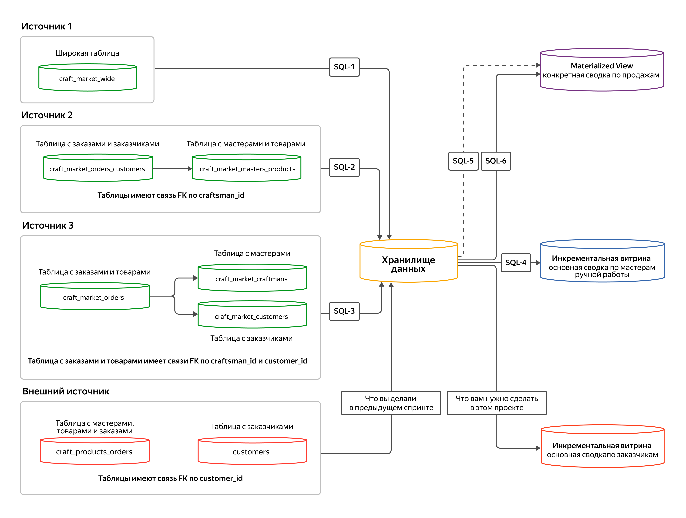

# Data Warehouse: New Source Integration & Customer Analytics

Data Engineering project focused on integrating a new data source into an existing Data Warehouse and building an incremental datamart for customer analytics.

## Project Context

A handicraft marketplace acquired a competitor website. The task is to integrate the new data source into the existing DWH infrastructure and create an analytical datamart for customer behavior analysis to support:
- Loyalty program development
- Customer interest analysis
- Product recommendation system
- Marketing campaign planning

## Architecture



*Data flows from 4 source systems through SQL-based ETL pipelines into the Data Warehouse, then aggregated into analytical datamarts.*

## Tech Stack

- **Database:** PostgreSQL
- **Data Modeling:** Star Schema (Kimball methodology)
- **ETL:** SQL-based incremental pipelines with CDC pattern

## Key Features

### 1. Multi-Source Data Integration
- Unified ETL pipeline consolidating 4 heterogeneous data sources
- MERGE operations for efficient upserts (insert/update)
- Temporary staging tables for data transformation

### 2. Incremental DataMart
- Delta-based loading using load timestamp tracking
- Separate INSERT and UPDATE logic for optimal performance
- Automatic detection of new vs. modified records

### 3. Customer Analytics Metrics
| Metric | Description |
|--------|-------------|
| `customer_money` | Total customer spending per month |
| `platform_money` | Platform commission (10%) |
| `count_order` | Monthly order count |
| `avg_price_order` | Average order value |
| `median_time_order_completed` | Median fulfillment time (days) |
| `top_product_category` | Most purchased category |
| `top_craftsman_id` | Most frequently ordered craftsman |
| Order status breakdown | created, in_progress, delivery, done, not_done |

## Project Structure

```
├── images/
│   └── architecture.png                      # DWH architecture diagram
├── scripts/
│   ├── DDL_customer_report_datamart.sql      # Customer datamart schema
│   ├── DDL_load_dates_craftsman_report_datamart.sql  # Incremental load tracking
│   ├── DWH_craftsman_market.sql              # Craftsman dimension ETL (MERGE)
│   ├── DWH_customers.sql                     # Customer dimension ETL
│   ├── DWH_pruduct.sql                       # Product dimension ETL
│   ├── DWH_f_orders.sql                      # Fact table ETL
│   └── DWH_customer_report_datamart.sql      # Customer datamart ETL
└── README.md
```

## Technical Implementation

### ETL Pipeline Pattern
```sql
-- 1. Create temp table with UNION of all sources
CREATE TEMP TABLE tmp_sources AS
SELECT ... FROM source1.craft_market_wide
UNION
SELECT ... FROM source2... JOIN ...
UNION
SELECT ... FROM source3... JOIN ...
UNION
SELECT ... FROM external_source... JOIN ...  -- NEW SOURCE

-- 2. MERGE into dimension tables
MERGE INTO dwh.d_craftsman ...
MERGE INTO dwh.d_customer ...
MERGE INTO dwh.d_product ...

-- 3. MERGE into fact table
MERGE INTO dwh.f_order ...
```

### Incremental Datamart Pattern
```sql
WITH
-- Delta: identify changed records since last load
dwh_delta AS (
    SELECT ...
    WHERE load_dttm > (SELECT MAX(load_dttm) FROM load_dates_table)
),
-- Separate new records from updates
dwh_delta_insert_result AS (...),
dwh_delta_update_result AS (...),
-- Apply changes
insert_delta AS (INSERT INTO datamart ...),
update_delta AS (UPDATE datamart ...),
-- Track load timestamp
insert_load_date AS (INSERT INTO load_dates_table ...)
SELECT 'increment datamart';
```

## Key SQL Techniques Used

- **Window Functions:** `RANK()`, `ROW_NUMBER()` for top category/craftsman
- **Statistical Functions:** `PERCENTILE_CONT()` for median calculation
- **Conditional Aggregation:** `CASE WHEN` for order status counts
- **CTE Chains:** Complex multi-step transformations
- **MERGE Statements:** Efficient upsert operations

## Skills Demonstrated

- Data Warehouse design (Star Schema)
- ETL pipeline development
- Incremental/Delta loading patterns
- Complex SQL (CTEs, window functions, aggregations)
- Data integration from multiple sources
- PostgreSQL
